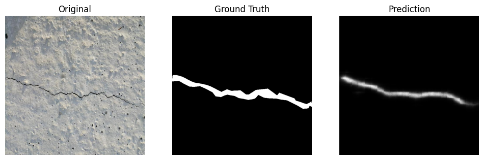
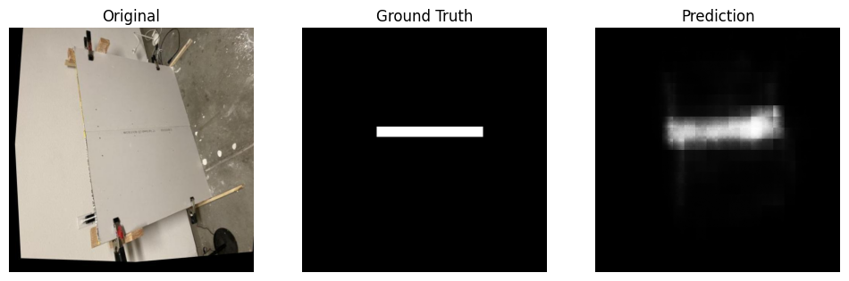

# 🧠 Prompted Segmentation for Drywall QA

### **Goal**

Train (or fine-tune) a text-conditioned segmentation model that, given an image and a natural language prompt, generates binary segmentation masks for:

* **“segment crack”**  → *Crack Dataset*
* **“segment taping area”**  → *Drywall-Join-Detect Dataset*

---

### **Datasets**

* **Dataset 1: Drywall-Join-Detect**
  Source: [Roboflow Dataset](https://universe.roboflow.com/objectdetect-pu6rn/drywall-join-detect)
  Prompts: “segment taping area”, “segment joint/tape”, “segment drywall seam”.

* **Dataset 2: Cracks**
  Source: [Roboflow Dataset](https://universe.roboflow.com/fyp-ny1jt/cracks-3ii36)
  Prompts: “segment crack”, “segment wall crack”.

---

### **Data Processing**

Both datasets originally contained **bounding box annotations** (object detection format). To train a segmentation model, these were converted into binary masks using their COCO annotations.

* For each image, we parsed the bounding box coordinates and generated white-filled regions (`255`) inside the detected area on a black background (`0`).
* This produced single-channel binary masks (PNG) with filenames like:

  * `290-dat_png_jpg.rf.fae08cc83d71639d5941cd365afd30e8__segment_crack.png`
  * `drywall_32_png.rf.e92b0b28__segment_taping_area.png`

Each dataset was then split into **train** and **validation** subsets:

```
Cracks Dataset:
  ├── Train: 5164 images
  └── Valid: 201 images

Drywall Dataset:
  ├── Train: 818 images
  └── Valid: 202 images
```

---

### **Model & Training Setup**

* **Base model:** `CIDAS/clipseg-rd64-refined`
* **Framework:** PyTorch + Hugging Face Transformers
* **Loss function:** Binary Cross Entropy with Logits
* **Metrics:** Dice Coefficient, Mean IoU (mIoU)
* **Optimizer:** AdamW (`lr=5e-5`)
* **Batch size:** 1 (limited by GPU memory)
* **Early stopping:** Stops after 3 epochs without improvement in Dice score
* **Device:** NVIDIA RTX 3060 (CUDA 12.9)

---

### **Results & Visualizations**

Below are sample qualitative results showing model performance for both tasks:

#### 🧱 Crack Segmentation

<p align="center">
  
  
</p>
<!-- <p align="center"><em>Left → Original | Middle → Ground Truth | Right → Model Prediction</em></p> -->

#### 🧩 Drywall Joint / Taping Area Segmentation

<p align="center">
  
</p>
<!-- <p align="center"><em>Left → Original | Middle → Ground Truth | Right → Model Prediction</em></p> -->

---

### **Performance Summary**

| Task                | Best Dice | mIoU  | Avg Inference Time (sec/img) | Model Size |
| ------------------- | --------- | ----- | ---------------------------- | ---------- |
| Crack Segmentation  | 0.390     | 0.290 | 0.016                        | 603.18 MB  |
| Drywall Taping Area | 0.645     | 0.508 | 0.023                        | 603.18 MB  |

---

### **Training Observations**

* The **drywall model** converged faster and achieved higher accuracy, likely due to more distinct regional textures.
* The **crack model** performed reasonably well but struggled with thin, fine-grained crack details.
* Early stopping helped avoid overfitting beyond ~7–8 epochs.
* Average training time per epoch:

  * Crack: ~4.5 minutes
  * Drywall: ~45 seconds

---

### **Key Insights**

* The CLIPSeg model successfully learned to segment cracks and taping regions from small datasets after fine-tuning.
* The drywall model achieved higher accuracy and consistency than the crack model.
* The mask generation process (from bounding boxes) worked reliably and allowed end-to-end segmentation training despite the original datasets lacking segmentation labels.
* Using a batch size of 1 ensured training stability on limited GPU memory.
* Early stopping prevented overfitting while maintaining steady improvement over epochs.

---

### **Report Summary**

| Category               | Description                                                                           |
| ---------------------- | ------------------------------------------------------------------------------------- |
| **Goal**               | Fine-tune text-conditioned segmentation model for drywall QA (cracks & taping areas). |
| **Datasets**           | Cracks & Drywall (converted from detection → segmentation).                           |
| **Model**              | CLIPSeg (CIDAS/clipseg-rd64-refined).                                                 |
| **Metrics**            | Dice Coefficient, mIoU.                                                               |
| **Training Time**      | Crack ≈ 31 min, Drywall ≈ 6 min.                                                      |
| **Best Dice**          | Crack = 0.390, Drywall = 0.645.                                                       |
| **Avg Inference Time** | Crack = 0.016 s/img, Drywall = 0.023 s/img.                                           |
| **Model Size**         | 603.18 MB each.                                                                       |
| **Hardware**           | NVIDIA RTX 3060 GPU (CUDA 12.9).                                                      |

---

<!-- 📘 *This project demonstrates the feasibility of adapting CLIPSeg for text-prompted segmentation tasks in the construction QA domain, even with limited and weakly annotated datasets.* -->
